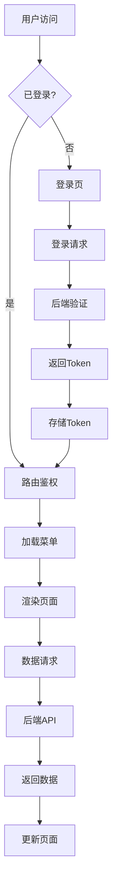

# 通用后台管理系统 - 项目架构文档

## 📁 项目目录结构

```
common-admin/
├── client/                    # 前端项目 (Vue3 + Vite + TS)
│   ├── public/               # 静态资源
│   ├── src/
│   │   ├── api/              # API接口定义
│   │   ├── assets/           # 资源文件
│   │   ├── components/       # 公共组件
│   │   │   ├── common/       # 通用组件
│   │   │   ├── layout/       # 布局组件
│   │   │   └── business/     # 业务组件
│   │   ├── composables/      # 组合式函数
│   │   ├── directives/       # 自定义指令
│   │   ├── hooks/            # 自定义Hooks
│   │   ├── locales/          # 多语言文件
│   │   │   ├── en.json
│   │   │   └── zh.json
│   │   ├── router/           # 路由配置
│   │   ├── stores/           # Pinia状态管理
│   │   ├── styles/           # 全局样式
│   │   ├── types/            # TypeScript类型定义
│   │   ├── utils/            # 工具函数
│   │   ├── views/            # 页面组件
│   │   │   ├── login/        # 登录页
│   │   │   ├── layout/       # 布局页
│   │   │   ├── dashboard/    # 数据统计
│   │   │   ├── user/         # 用户管理
│   │   │   ├── role/         # 角色权限
│   │   │   ├── content/      # 内容管理
│   │   │   └── settings/     # 系统设置
│   │   ├── App.vue           # 根组件
│   │   └── main.ts           # 入口文件
│   ├── .env                  # 环境变量
│   ├── .env.development      # 开发环境
│   ├── .env.test             # 测试环境
│   ├── .env.production       # 生产环境
│   ├── eslint.config.js      # ESLint配置
│   ├── prettier.config.js    # Prettier配置
│   ├── tsconfig.json         # TypeScript配置
│   ├── vite.config.ts        # Vite配置
│   └── package.json
│
├── server/                    # 后端项目 (Koa)
│   ├── src/
│   │   ├── controllers/      # 控制器
│   │   ├── middleware/       # 中间件
│   │   ├── routes/           # 路由定义
│   │   ├── services/         # 业务逻辑
│   │   └── utils/            # 工具函数
│   ├── data/                 # Mock数据
│   ├── app.js                # 应用入口
│   └── package.json
│
└── README.md
```

## 🔧 技术栈

### 前端
- **框架**: Vue 3 + Composition API
- **构建工具**: Vite 5
- **语言**: TypeScript 5
- **状态管理**: Pinia
- **路由**: Vue Router 4
- **UI框架**: Element Plus
- **HTTP客户端**: Ky
- **数据请求**: TanStack Query (Vue Query)
- **工具库**: date-fns, vueuse, lodash-es, i18next
- **代码规范**: ESLint + Prettier
- **样式**: SCSS + CSS Variables

### 后端
- **框架**: Koa 2
- **语言**: Node.js + TypeScript
- **跨域**: @koa/cors
- **请求解析**: koa-bodyparser

## 📱 响应式设计

- **桌面端 (>1200px)**: 完整侧边栏导航
- **平板端 (768-1200px)**: 可折叠侧边栏
- **移动端 (<768px)**: 底部导航或抽屉式菜单

## 🔐 权限系统

- **角色**: 超级管理员、管理员、普通用户
- **菜单权限**: 基于角色的动态菜单
- **按钮权限**: 自定义指令控制

## 🌍 多语言支持

- **中文 (zh)**: 默认语言
- **英文 (en)**: 完整翻译
- **i18next**: 国际化方案

## 📊 功能模块

### 1. 登录模块
- 用户名/密码登录
- 记住密码
- 登录状态保持

### 2. 数据统计 (Dashboard)
- 关键指标卡片
- 统计数据表格
- 趋势数据展示

### 3. 用户管理
- 用户列表
- 新增/编辑用户
- 用户详情
- 批量操作

### 4. 角色权限
- 角色列表
- 角色权限配置
- 菜单权限分配

### 5. 内容管理
- 内容列表
- 内容发布/编辑
- 分类管理

### 6. 系统设置
- 基本设置
- 安全设置
- 通知设置

## 🔄 数据流程



## 🚀 开发环境

- **Node.js**: >= 18.0.0
- **包管理器**: pnpm / npm / yarn
- **开发端口**: 前端5173, 后端3000

## 📦 第三方库版本

```json
{
  "vue": "^3.4.0",
  "vite": "^5.0.0",
  "typescript": "^5.3.0",
  "pinia": "^2.1.0",
  "vue-router": "^4.2.0",
  "element-plus": "^2.5.0",
  "ky": "^1.2.0",
  "@tanstack/vue-query": "^5.0.0",
  "i18next": "^23.7.0",
  "date-fns": "^3.0.0",
  "vueuse": "^10.7.0",
  "lodash-es": "^4.17.0"
}
```

## 🎯 开发规范

### 代码风格
- 使用 Composition API
- 组件名使用 PascalCase
- 文件名使用 kebab-case
- 样式使用 SCSS BEM 命名

### Git规范
- feat: 新功能
- fix: Bug修复
- docs: 文档更新
- style: 代码格式
- refactor: 重构
- test: 测试
- chore: 构建/工具

## 📋 后续扩展

- 暗黑模式支持
- 主题定制
- 性能优化
- 单元测试
- E2E测试
