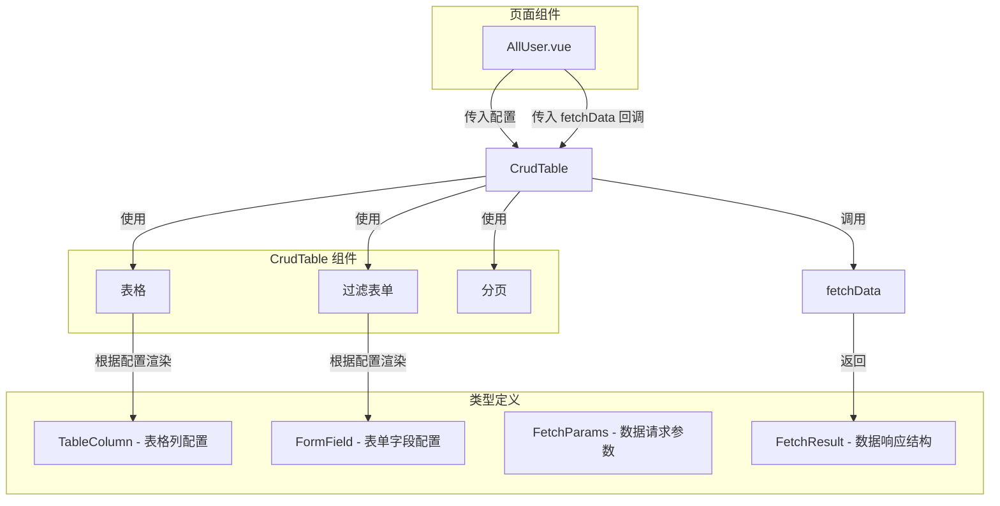

# 通用 CRUD 表格组件设计

## 1. 组件概述

组件名称：`CrudTable`
职责：只负责将过滤表单和表格打包展示，不包含任何业务逻辑
设计原则：配置驱动，一切皆可配置

## 2. 组件结构

```
src/components/
├── CrudTable/
│   ├── index.vue          # 主组件
│   ├── types.ts           # 类型定义
│   └── index.ts           # 导出入口
```

## 3. 类型定义

```typescript
// src/components/CrudTable/types.ts

import type { VNode } from 'vue'

// 表格列配置
export interface TableColumn {
  key: string                    // 数据字段名
  label: string                  // 列标题
  width?: string | number        // 列宽度
  minWidth?: string | number     // 最小宽度
  fixed?: 'left' | 'right'       // 固定列
  align?: 'left' | 'center' | 'right'  // 对齐方式
  sortable?: boolean | 'custom'  // 是否可排序
  formatter?: (row: any, column: TableColumn, cellValue: any) => any  // 格式化函数
  slotName?: string              // 自定义插槽名称
}

// 表单字段类型
export type FormFieldType = 
  | 'input' 
  | 'select' 
  | 'radio' 
  | 'checkbox' 
  | 'date' 
  | 'datetime' 
  | 'daterange' 
  | 'switch'

// 表单字段配置
export interface FormField {
  key: string              // 字段名，对应 filterForm 的属性
  label: string            // 字段标签
  type: FormFieldType      // 字段类型
  placeholder?: string     // 占位符
  options?: SelectOption[] // 选项（select/radio/checkbox）
  defaultValue?: any       // 默认值
  clearable?: boolean      // 是否可清空
  attrs?: Record<string, any>  // 其他 Element Plus 属性
}

// 下拉选项
export interface SelectOption {
  label: string
  value: any
  disabled?: boolean
}

// 分页配置
export interface PaginationConfig {
  pageSize: number         // 默认每页条数
  pageSizes: number[]      // 可选每页条数
  layout?: string          // 分页布局
}

// 表格配置
export interface TableConfig {
  stripe?: boolean         // 斑马纹
  border?: boolean         // 边框
  size?: 'large' | 'default' | 'small'
  selection?: boolean      // 是否显示选择列
  index?: boolean | number // 是否显示索引列
}

// 组件 Props
export interface CrudTableProps {
  // 必填
  columns: TableColumn[]           // 表格列配置
  fetchData: (params: FetchParams) => Promise<FetchResult<any>>  // 数据获取函数
  
  // 表单配置
  filterFields?: FormField[]       // 过滤表单字段配置
  showFilter?: boolean             // 是否显示过滤表单（默认 true）
  
  // 分页配置
  pagination?: Partial<PaginationConfig>
  
  // 表格配置
  tableConfig?: Partial<TableConfig>
  
  // 事件回调
  onEdit?: (row: any) => void      // 编辑回调
  onDelete?: (row: any) => void    // 删除回调
  onSelectionChange?: (rows: any[]) => void  // 选择变化回调
}

// 数据获取参数
export interface FetchParams {
  page: number
  pageSize: number
  filters: Record<string, any>
  sort?: { prop: string; order: 'asc' | 'desc' }
}

// 数据获取结果
export interface FetchResult<T> {
  list: T[]
  total: number
  page: number
  pageSize: number
}
```

## 4. 组件接口设计

```vue
<!-- src/components/CrudTable/index.vue -->
<template>
  <div class="crud-table">
    <!-- 过滤表单 -->
    <el-form 
      v-if="showFilter && filterFields.length > 0"
      :model="filterForm"
      inline
      class="filter-form"
    >
      <el-form-item 
        v-for="field in filterFields" 
        :key="field.key"
        :label="field.label"
      >
        <!-- 输入框 -->
        <el-input
          v-if="field.type === 'input'"
          v-model="filterForm[field.key]"
          :placeholder="field.placeholder"
          :clearable="field.clearable ?? true"
          v-bind="field.attrs"
          @clear="handleSearch"
        />
        
        <!-- 下拉选择 -->
        <el-select
          v-else-if="field.type === 'select'"
          v-model="filterForm[field.key]"
          :placeholder="field.placeholder"
          :clearable="field.clearable ?? true"
          v-bind="field.attrs"
        >
          <el-option
            v-for="opt in field.options"
            :key="opt.value"
            :label="opt.label"
            :value="opt.value"
            :disabled="opt.disabled"
          />
        </el-select>
        
        <!-- 单选 -->
        <el-radio-group
          v-else-if="field.type === 'radio'"
          v-model="filterForm[field.key]"
          v-bind="field.attrs"
        >
          <el-radio
            v-for="opt in field.options"
            :key="opt.value"
            :value="opt.value"
          >
            {{ opt.label }}
          </el-radio>
        </el-radio-group>
        
        <!-- 开关 -->
        <el-switch
          v-else-if="field.type === 'switch'"
          v-model="filterForm[field.key]"
          v-bind="field.attrs"
        />
        
        <!-- 日期选择 -->
        <el-date-picker
          v-else-if="field.type === 'date'"
          v-model="filterForm[field.key]"
          type="date"
          :placeholder="field.placeholder"
          :clearable="field.clearable ?? true"
          v-bind="field.attrs"
          value-format="YYYY-MM-DD"
        />
        
        <!-- 日期范围 -->
        <el-date-picker
          v-else-if="field.type === 'daterange'"
          v-model="filterForm[field.key]"
          type="daterange"
          :clearable="field.clearable ?? true"
          v-bind="field.attrs"
          value-format="YYYY-MM-DD"
        />
      </el-form-item>
      
      <el-form-item>
        <el-button type="primary" @click="handleSearch">
          <el-icon><Search /></el-icon>
          搜索
        </el-button>
        <el-button @click="handleReset">
          <el-icon><Refresh /></el-icon>
          重置
        </el-button>
      </el-form-item>
    </el-form>
    
    <!-- 表格 -->
    <el-table
      v-loading="loading"
      :data="tableData"
      v-bind="tableConfig"
      @selection-change="handleSelectionChange"
      @sort-change="handleSortChange"
    >
      <!-- 选择列 -->
      <el-table-column
        v-if="tableConfig?.selection"
        type="selection"
        width="50"
      />
      
      <!-- 索引列 -->
      <el-table-column
        v-if="tableConfig?.index !== undefined"
        type="index"
        :index="typeof tableConfig.index === 'number' ? tableConfig.index : undefined"
        width="60"
      />
      
      <!-- 动态列 -->
      <el-table-column
        v-for="col in columns"
        :key="col.key"
        :prop="col.key"
        :label="col.label"
        :width="col.width"
        :min-width="col.minWidth || '120'"
        :fixed="col.fixed"
        :align="col.align || 'left'"
        :sortable="col.sortable"
        :formatter="col.formatter"
      >
        <!-- 自定义插槽 -->
        <template v-if="col.slotName" #default="{ row }">
          <slot :name="col.slotName" :row="row" />
        </template>
      </el-table-column>
      
      <!-- 操作列（通过插槽提供） -->
      <slot name="actions" />
    </el-table>
    
    <!-- 分页 -->
    <div class="pagination-wrapper">
      <el-pagination
        v-model:current-page="pagination.page"
        v-model:page-size="pagination.pageSize"
        :page-sizes="pagination.pageSizes"
        :total="pagination.total"
        :layout="pagination.layout || 'total, sizes, prev, pager, next, jumper'"
        @size-change="handleSearch"
        @current-change="handlePageChange"
      />
    </div>
  </div>
</template>

<script setup lang="ts">
import { ref, reactive, watch, onMounted } from 'vue'
import type { 
  CrudTableProps, 
  TableColumn, 
  FormField, 
  FetchParams,
  FetchResult 
} from './types'
import { Search, Refresh } from '@element-plus/icons-vue'

const props = defineProps<CrudTableProps>()

// 响应式状态
const loading = ref(false)
const tableData = ref<any[]>([])
const pagination = reactive({
  page: 1,
  pageSize: props.pagination?.pageSize || 10,
  pageSizes: props.pagination?.pageSizes || [10, 20, 50, 100],
  total: 0,
})

// 过滤表单
const filterForm = reactive<Record<string, any>>({})
// 初始化过滤表单默认值
props.filterFields?.forEach(field => {
  filterForm[field.key] = field.defaultValue ?? null
})

// 排序
const sortParams = ref<{ prop: string; order: 'asc' | 'desc' } | null>(null)

// 加载数据
async function loadData() {
  loading.value = true
  try {
    const params: FetchParams = {
      page: pagination.page,
      pageSize: pagination.pageSize,
      filters: { ...filterForm },
      sort: sortParams.value ?? undefined,
    }
    
    const res = await props.fetchData(params)
    tableData.value = res.list
    pagination.total = res.total
    pagination.page = res.page
    pagination.pageSize = res.pageSize
  } catch (error) {
    console.error('加载数据失败:', error)
  } finally {
    loading.value = false
  }
}

// 搜索
function handleSearch() {
  pagination.page = 1
  loadData()
}

// 重置
function handleReset() {
  // 重置表单值
  props.filterFields?.forEach(field => {
    filterForm[field.key] = field.defaultValue ?? null
  })
  handleSearch()
}

// 页码变化
function handlePageChange(page: number) {
  pagination.page = page
  loadData()
}

// 选择变化
function handleSelectionChange(selection: any[]) {
  props.onSelectionChange?.(selection)
}

// 排序变化
function handleSortChange({ prop, order }: { prop: string; order: 'asc' | 'desc' | null }) {
  if (!prop || !order) {
    sortParams.value = null
  } else {
    sortParams.value = { prop, order }
  }
  loadData()
}

// 暴露方法
defineExpose({
  reload: loadData,
  reset: handleReset,
  setPage: (page: number) => {
    pagination.page = page
    loadData()
  },
})

// 初始化
onMounted(() => {
  loadData()
})
</script>

<style lang="scss" scoped>
.crud-table {
  .filter-form {
    margin-bottom: 20px;
    padding: 20px;
    background: #fff;
    border-radius: 4px;
  }
  
  .pagination-wrapper {
    display: flex;
    justify-content: flex-end;
    margin-top: 20px;
  }
}
</style>
```

## 5. 组件导出

```typescript
// src/components/CrudTable/index.ts
import CrudTable from './index.vue'

export { CrudTable }
export type { 
  CrudTableProps, 
  TableColumn, 
  FormField, 
  FetchParams, 
  FetchResult 
} from './types'

export default CrudTable
```

## 6. 使用示例

### 6.1 基础用法

```vue
<template>
  <CrudTable
    :columns="columns"
    :filter-fields="filterFields"
    :fetch-data="fetchUserList"
    :pagination="{ pageSize: 10, pageSizes: [10, 20, 50] }"
    @edit="handleEdit"
    @delete="handleDelete"
  />
</template>

<script setup lang="ts">
import { CrudTable } from '@/components/CrudTable'
import type { TableColumn, FormField } from '@/components/CrudTable/types'

const columns: TableColumn[] = [
  { key: 'id', label: 'ID', width: 80 },
  { key: 'username', label: '用户名', minWidth: 120 },
  { key: 'email', label: '邮箱', minWidth: 150 },
  { key: 'status', label: '状态', minWidth: 80, 
    formatter: (row) => row.status === 1 ? '启用' : '禁用' 
  },
]

const filterFields: FormField[] = [
  { key: 'keyword', label: '关键词', type: 'input', placeholder: '请输入用户名或邮箱' },
  { key: 'status', label: '状态', type: 'select', 
    options: [
      { label: '全部', value: '' },
      { label: '启用', value: 1 },
      { label: '禁用', value: 0 },
    ]
  },
]

async function fetchUserList(params: FetchParams) {
  const res = await userApi.getList(params)
  return res.data
}

function handleEdit(row: User) {
  // 编辑逻辑
}

function handleDelete(row: User) {
  // 删除逻辑
}
</script>
```

### 6.2 自定义操作列

```vue
<template>
  <CrudTable
    :columns="columns"
    :filter-fields="filterFields"
    :fetch-data="fetchData"
  >
    <template #actions="{ row }">
      <el-button type="primary" link @click="handleEdit(row)">编辑</el-button>
      <el-button type="danger" link @click="handleDelete(row)">删除</el-button>
    </template>
  </CrudTable>
</template>
```

### 6.3 自定义列内容

```vue
<template>
  <CrudTable
    :columns="columns"
    :fetch-data="fetchData"
  >
    <template #username="{ row }">
      <div class="user-info">
        <el-avatar :size="32" :src="row.avatar" />
        <span>{{ row.username }}</span>
      </div>
    </template>
  </CrudTable>
</template>

<script setup lang="ts">
const columns: TableColumn[] = [
  { key: 'username', label: '用户名', slotName: 'username' },
  // ...
]
</script>
```

## 7. 架构图



## 8. 组件职责边界

### 组件负责：
- ✅ 根据配置渲染过滤表单
- ✅ 根据配置渲染表格列
- ✅ 处理分页逻辑
- ✅ 处理搜索/重置
- ✅ 处理排序
- ✅ 处理选择变化
- ✅ 调用传入的 fetchData 函数

### 组件不负责：
- ❌ 业务逻辑判断
- ❌ 数据处理/转换
- ❌ API 调用实现
- ❌ 弹窗/对话框
- ❌ 权限控制
- ❌ 复杂交互逻辑

## 9. 下一步工作

1. 在 `Code` 模式下创建组件文件和类型定义
2. 实现组件的完整功能
3. 在 `AllUser.vue` 中进行迁移测试
4. 编写组件文档和使用指南

## 10. 更多使用场景示例

### 10.1 内容管理页面 - 多条件筛选 + 状态标签

```vue
<template>
  <CrudTable
    ref="contentTable"
    :columns="columns"
    :filter-fields="filterFields"
    :fetch-data="fetchContentList"
    :pagination="{ pageSize: 20, pageSizes: [10, 20, 50] }"
    :table-config="{ selection: true }"
    @selection-change="handleSelectionChange"
  >
    <template #title="{ row }">
      <div class="content-title">
        <el-tag v-if="row.top" type="warning" size="small">置顶</el-tag>
        <span>{{ row.title }}</span>
      </div>
    </template>

    <template #status="{ row }">
      <el-tag :type="statusTagType[row.status]">
        {{ statusMap[row.status] }}
      </el-tag>
    </template>

    <template #actions="{ row }">
      <el-button type="primary" link @click="handleView(row)">查看</el-button>
      <el-button type="primary" link @click="handleEdit(row)">编辑</el-button>
      <el-dropdown @command="cmd => handleCommand(cmd, row)">
        <el-button type="primary" link>更多<el-icon class="el-icon--right"><ArrowDown /></el-icon></el-button>
        <template #dropdown>
          <el-dropdown-menu>
            <el-dropdown-item command="publish">发布</el-dropdown-item>
            <el-dropdown-item command="archive">归档</el-dropdown-item>
            <el-dropdown-item command="delete" divided>删除</el-dropdown-item>
          </el-dropdown-menu>
        </template>
      </el-dropdown>
    </template>
  </CrudTable>
</template>

<script setup lang="ts">
import { CrudTable } from '@/components/CrudTable'
import type { TableColumn, FormField, FetchParams } from '@/components/CrudTable/types'
import { ArrowDown } from '@element-plus/icons-vue'

const contentTable = ref()

const statusMap: Record<string, string> = {
  draft: '草稿',
  published: '已发布',
  archived: '已归档'
}

const statusTagType: Record<string, string> = {
  draft: 'info',
  published: 'success',
  archived: 'warning'
}

const columns: TableColumn[] = [
  { key: 'title', label: '标题', minWidth: 200, slotName: 'title' },
  { key: 'category', label: '分类', width: 100 },
  { key: 'author', label: '作者', width: 100 },
  { key: 'views', label: '浏览量', width: 100, sortable: 'custom' },
  { key: 'status', label: '状态', width: 100, slotName: 'status' },
  { key: 'createdAt', label: '创建时间', width: 180, sortable: 'custom' },
]

const filterFields: FormField[] = [
  { 
    key: 'keyword', 
    label: '关键词', 
    type: 'input', 
    placeholder: '搜索标题/作者',
    attrs: { style: 'width: 200px' }
  },
  { 
    key: 'category', 
    label: '分类', 
    type: 'select',
    options: [
      { label: '全部', value: '' },
      { label: '技术文章', value: 'tech' },
      { label: '产品动态', value: 'product' },
      { label: '运营活动', value: 'operation' }
    ]
  },
  { 
    key: 'status', 
    label: '状态', 
    type: 'select',
    options: [
      { label: '全部', value: '' },
      { label: '草稿', value: 'draft' },
      { label: '已发布', value: 'published' },
      { label: '已归档', value: 'archived' }
    ]
  },
  {
    key: 'dateRange',
    label: '日期范围',
    type: 'daterange',
    defaultValue: null
  }
]

async function fetchContentList(params: FetchParams) {
  const { filters, ...rest } = params
  // 处理日期范围
  const query = {
    ...rest,
    ...filters,
    startDate: filters.dateRange?.[0] || '',
    endDate: filters.dateRange?.[1] || ''
  }
  delete query.dateRange
  
  return await contentApi.getList(query)
}

function handleSelectionChange(selection: any[]) {
  console.log('选中内容:', selection)
}

function handleView(row: Content) {
  // 查看详情
}

function handleEdit(row: Content) {
  // 编辑
}

function handleCommand(cmd: string, row: Content) {
  switch (cmd) {
    case 'publish': publishContent(row)
    case 'archive': archiveContent(row)
    case 'delete': deleteContent(row)
  }
}

// 外部刷新表格
function refreshTable() {
  contentTable.value?.reload()
}
</script>
```

### 10.2 角色权限管理 - 复杂操作列 + 树形数据

```vue
<template>
  <CrudTable
    :columns="columns"
    :filter-fields="filterFields"
    :fetch-data="fetchRoleList"
    :pagination="{ pageSize: 15 }"
  >
    <template #permissions="{ row }">
      <el-tag
        v-for="perm in row.permissions.slice(0, 3)"
        :key="perm"
        size="small"
        class="permission-tag"
      >
        {{ perm }}
      </el-tag>
      <el-tag v-if="row.permissions.length > 3" size="small" type="info">
        +{{ row.permissions.length - 3 }}
      </el-tag>
    </template>

    <template #status="{ row }">
      <el-switch
        :model-value="row.status"
        @change="val => handleStatusChange(row, val)"
      />
    </template>

    <template #actions="{ row }">
      <el-button type="primary" link @click="handlePermission(row)">权限</el-button>
      <el-button type="primary" link @click="handleEdit(row)">编辑</el-button>
      <el-button type="danger" link @click="handleDelete(row)">删除</el-button>
    </template>
  </CrudTable>
</template>

<script setup lang="ts">
import { CrudTable } from '@/components/CrudTable'
import type { TableColumn, FormField, FetchParams } from '@/components/CrudTable/types'

const columns: TableColumn[] = [
  { key: 'name', label: '角色名称', minWidth: 120 },
  { key: 'code', label: '角色编码', width: 120 },
  { key: 'description', label: '描述', minWidth: 150 },
  { key: 'permissions', label: '权限', minWidth: 200, slotName: 'permissions' },
  { key: 'status', label: '状态', width: 80, slotName: 'status' },
  { key: 'createdAt', label: '创建时间', width: 180 },
]

const filterFields: FormField[] = [
  { key: 'keyword', label: '角色名称', type: 'input', placeholder: '搜索角色' },
  {
    key: 'status',
    label: '状态',
    type: 'radio',
    options: [
      { label: '全部', value: '' },
      { label: '启用', value: 1 },
      { label: '禁用', value: 0 }
    ],
    defaultValue: ''
  }
]

async function fetchRoleList(params: FetchParams) {
  return await roleApi.getList(params)
}

async function handleStatusChange(row: Role, value: boolean) {
  await roleApi.updateStatus(row.id, value ? 1 : 0)
}
</script>

<style lang="scss" scoped>
.permission-tag {
  margin-right: 4px;
  margin-bottom: 4px;
}
</style>
```

### 10.3 订单管理 - 日期范围 + 状态筛选 + 批量操作

```vue
<template>
  <div class="order-page">
    <div class="page-header">
      <h2>订单管理</h2>
      <el-button type="primary" @click="handleBatchExport" :disabled="selectedIds.length === 0">
        批量导出
      </el-button>
    </div>

    <CrudTable
      ref="orderTable"
      :columns="columns"
      :filter-fields="filterFields"
      :fetch-data="fetchOrderList"
      :table-config="{ selection: true, index: 1 }"
      @selection-change="handleSelectionChange"
    >
      <template #orderNo="{ row }">
        <el-link type="primary" @click="handleView(row)">{{ row.orderNo }}</el-link>
      </template>

      <template #amount="{ row }">
        <span class="amount">¥{{ row.amount.toFixed(2) }}</span>
      </template>

      <template #status="{ row }">
        <el-tag :type="orderStatusType[row.status]">{{ orderStatusText[row.status] }}</el-tag>
      </template>

      <template #actions="{ row }">
        <el-button type="primary" link @click="handleView(row)">详情</el-button>
        <el-button v-if="row.status === 'pending'" type="warning" link @click="handleShip(row)">发货</el-button>
        <el-button v-if="row.status === 'shipped'" type="success" link @click="handleComplete(row)">完成</el-button>
      </template>
    </CrudTable>
  </div>
</template>

<script setup lang="ts">
import { CrudTable } from '@/components/CrudTable'
import type { TableColumn, FormField, FetchParams } from '@/components/CrudTable/types'

const orderTable = ref()
const selectedIds = ref<number[]>([])

const orderStatusText: Record<string, string> = {
  pending: '待付款',
  paid: '待发货',
  shipped: '已发货',
  completed: '已完成',
  cancelled: '已取消'
}

const orderStatusType: Record<string, string> = {
  pending: 'warning',
  paid: 'info',
  shipped: 'primary',
  completed: 'success',
  cancelled: 'danger'
}

const columns: TableColumn[] = [
  { key: 'orderNo', label: '订单号', minWidth: 160, slotName: 'orderNo' },
  { key: 'customer', label: '客户', width: 100 },
  { key: 'productCount', label: '商品数', width: 80, align: 'center' },
  { key: 'amount', label: '金额', width: 100, align: 'right', slotName: 'amount' },
  { key: 'status', label: '状态', width: 100, slotName: 'status' },
  { key: 'createdAt', label: '下单时间', width: 180, sortable: 'custom' },
]

const filterFields: FormField[] = [
  {
    key: 'orderNo',
    label: '订单号',
    type: 'input',
    placeholder: '请输入订单号',
    attrs: { style: 'width: 180px' }
  },
  {
    key: 'status',
    label: '订单状态',
    type: 'select',
    options: [
      { label: '全部', value: '' },
      { label: '待付款', value: 'pending' },
      { label: '待发货', value: 'paid' },
      { label: '已发货', value: 'shipped' },
      { label: '已完成', value: 'completed' },
      { label: '已取消', value: 'cancelled' }
    ]
  },
  {
    key: 'dateRange',
    label: '下单日期',
    type: 'daterange',
    attrs: { style: 'width: 240px' }
  }
]

async function fetchOrderList(params: FetchParams) {
  const { filters, ...rest } = params
  return await orderApi.getList({
    ...rest,
    startDate: filters.dateRange?.[0] || '',
    endDate: filters.dateRange?.[1] || ''
  })
}

function handleSelectionChange(selection: any[]) {
  selectedIds.value = selection.map(item => item.id)
}

function handleBatchExport() {
  orderApi.exportOrders(selectedIds.value)
}

function handleView(row: Order) {
  // 查看订单详情
}

function handleShip(row: Order) {
  // 发货操作
}

function handleComplete(row: Order) {
  // 完成订单
}
</script>
```

### 10.4 统计仪表盘 - 无分页 + 只读表格

```vue
<template>
  <CrudTable
    :columns="columns"
    :fetch-data="fetchStatistics"
    :pagination="false"
    :table-config="{ border: true, size: 'small' }"
  />
</template>

<script setup lang="ts">
import { CrudTable } from '@/components/CrudTable'
import type { TableColumn, FetchParams } from '@/components/CrudTable/types'

const columns: TableColumn[] = [
  { key: 'metric', label: '指标', width: 150 },
  { key: 'today', label: '今日', width: 120, align: 'right' },
  { key: 'yesterday', label: '昨日', width: 120, align: 'right' },
  { key: 'week', label: '本周', width: 120, align: 'right' },
  { key: 'month', label: '本月', width: 120, align: 'right' },
  { 
    key: 'growth', 
    label: '增长率', 
    width: 120, 
    align: 'right',
    formatter: (row) => {
      const growth = row.growth
      const type = growth >= 0 ? 'success' : 'danger'
      const symbol = growth >= 0 ? '+' : ''
      return `<el-tag type="${type}">${symbol}${growth}%</el-tag>`
    }
  },
]

async function fetchStatistics(params: FetchParams) {
  const stats = await dashboardApi.getStatistics()
  return {
    list: stats,
    total: stats.length,
    page: 1,
    pageSize: 10
  }
}
</script>
```

### 10.5 配置项快速参考

| 配置项 | 必填 | 类型 | 说明 |
|--------|------|------|------|
| columns | 是 | TableColumn[] | 表格列配置 |
| fetchData | 是 | Function | 数据获取函数 |
| filterFields | 否 | FormField[] | 过滤表单字段 |
| showFilter | 否 | boolean | 是否显示过滤表单，默认 true |
| pagination | 否 | PaginationConfig | 分页配置 |
| tableConfig | 否 | TableConfig | 表格样式配置 |
| onEdit | 否 | Function | 编辑回调 |
| onDelete | 否 | Function | 删除回调 |
| onSelectionChange | 否 | Function | 选择变化回调 |

### 10.6 最佳实践建议

1. **页面组件只负责业务逻辑**：页面组件处理弹窗、API 调用、数据转换等业务逻辑
2. **抽取通用配置**：将表格列和表单字段配置抽取到单独的文件或常量中
3. **利用类型系统**：使用 TypeScript 类型定义确保配置正确性
4. **善用插槽**：复杂展示逻辑通过插槽处理，保持组件简洁
5. **暴露必要方法**：通过 ref 暴露 reload、reset 等方法供外部调用
